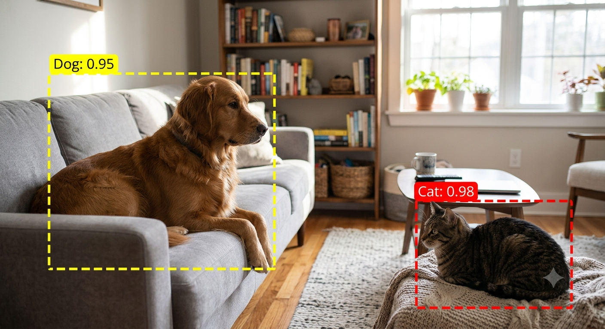
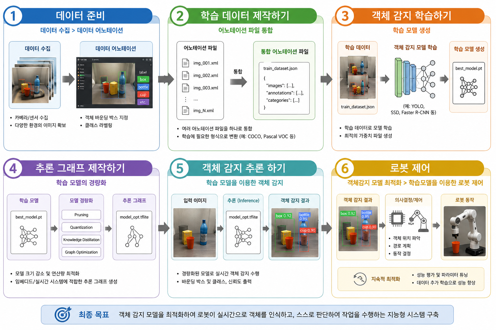
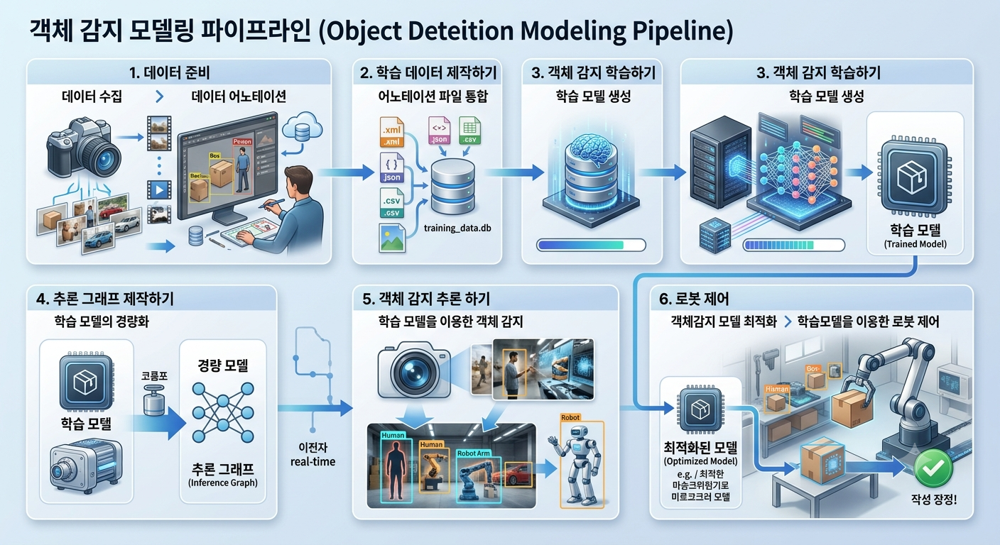

# Chapter 1. 객체 감지 AI

> 학습목표  
> ▶ 객체 감지의 원리를 이해한다.  
> ▶ 인공지능 모델을 직접 생성하고 객체 감지의 동작을 확인할 수 있다.

## 1.1. 준비하기

### 1.1.1.1 객체 감지 (Object Detection)

객체 검출의 목적은 여러 클래스가 주어졌을 때, 각 이미지 내에 주어진 클래스에 속하는 객체를 모두 찾는 것입니다.  
예를 들면, 강아지, 고양이 이미지에서 강아지와 고양이를 검출하는 작업이 있다고 했을 때,   
강아지와 고양이가 주어진 클래스이고 이미지 내의 모든 강아지와 고양이를 찾아 표시하는 작업이 객체 검출입니다.  
객체 검출에서 레이블링은 각 이미지 내에 주어진 클래스에 속하는 모든 객체의 위치와 알맞은 클래스를 할당하는 것이다.  
한 이미지에 한 개 이상의 레이블이 존재할 수 있다.  

[그림] 객체 감지

### 1.1.2 객체 감지 모델링 순서

[그림] 객체 감지 모델링

#### (1) 데이터 준비

1) 데이터 수집
   * 사용자가 만들고자 하는 인공지능이 어떤 모적으로 사요하려고 하는지 계획을 세우고, 그ㅔㅇ 맞는 데이터를 수집하는 과정이다.
   * 만약, 사용자가 만들고자 하는 것이 자동차의 아율주행을 목적으로 한다면 자동차의 주행과 롼연된 표지판이나 신호들의 데이터를 수집해야 한다.

3) 데이터 어노테이션
   * 객체 감지 학습에는 사용되는 데이터마다 객체의 정보가 필요하다.
   * 이를 위해 수집한 데이터에 대한 이미지 데이터 셋 제작을 진해한다.
   * 이미지 데이터 셋 제작을 어노테이션(Annotation)이라 하며, 오노페이션은 수집한 데이터에 레이블과 그 위치를 지정하는 작업이다.

#### (2) 학습 데이터 제작하기

* 학습을 위한 데이터를 제작하는 과정이다.
* 학습을 위해 앞에서 준비한 데이터를 이미지와 어노테이션 파일을 학습에 사용할 수 있도록 하나의 파일로 합쳐주고, 학습에서 사용할 수 있는 파일 형식으로 변화한다.

#### (3) 객체 감지 학습하기

   * 학습을 통해 학습 모델을 생성하는 과정이다. 학습을 시킬 때에는 학습에 필요한 파라미터값을 잘 설정해야 한다.
   * 학습을 많이 한다고 하여 지능이 무조건 종하지는 것은 아니다.
   * 사용자가 준비한 데이터를 어떻게 나누고, 몇 번을 학습시키느야에 따라 지능이 달라진다.

#### (4) 추론 그래프 작성하기

   * 추론에 사용되지 않는 불필요한 부분을 제외하기 위해 그래프를 생성한다.
   * 학습이 진행되는 과정에서 10분마다 체크포인트가 생성되며, 체크포인트에 해당되는 학습 모델이 함께 생성된다.
   * 학습이 완료된 폴더에는 상황에 따라 여러 개의 학습 모델이 생성되기 때문에 이 중 학습 에 사용할 체크포인트의 학습 모델을 선택하여 최적의 학습 모델을 제작한다.

#### (5) 객체 감지 추론하기

* 학습 모델을 검증하는 과정이다. 검증 과정을 통해 학습이 잘 되었는지를 확인하다.
* 이때 학습결과가 좋지 않다면 어떤 부분이 부족하였는지를 생각하여 그 부분을 보완하여야 한다.

#### (6) 로봇 제어

1) 객체 감지 모델 최적화
   * 로봇에서 학습 모델을 적용하기 전에 로봇의 Jetson 보드에 최적화 시킨다.
   * 최적화가 되지 않았을 경우 학습 모델이 사용하는 GPU 메모리가 크기 때문에 동작 실행이 안 될 수고 있다.

2) 학슴 모델을 이용한 로봇 제어
   * 학습 모델을 로봇에서 검증하는 과정이다.
   * 로봇의 시점에서 학습 모델의 동작을 확인한다.
   * 감지되는 결과에 따라 로봇의 동작이 달라지는 것을 확인할 수 있다.

---

### 학습 데이터셋

#### 1. [Kaggle](https://www.kaggle.com/) (캐글) – 가장 쉽고 빠르게 다운로드

   * 데이터 분석 및 AI 경진대회 플랫폼인 캐글에서 'Dog vs Cat'을 검색하면 전처리된 데이터셋을 바로 받을 수 있습니다.
      * Dogs vs. Cats (Kaggle Dataset): 과거 마이크로소프트가 진행한 콘테스트 데이터로, 고양이와 강아지 사진 총 25,000장이 포함되어 있습니다.
         * 이미지 분류(Classification) 입문용으로 가장 많이 쓰입니다.
      * 추천 이유: 웹 브라우저나 Kaggle API를 통해 회원가입 후 원클릭으로 쉽게 다운로드할 수 있으며, 관련 주피터 노트북(코드) 예제가 풍부합니다.

#### 2. [Roboflow]([   * ](https://roboflow.com/)) (로보플로우) – 바운딩 박스(레이블)까지 포함된 데이터

   * 앞서 언급하신 객체 감지(Object Detection) 학습까지 고려하고 있다면 로보플로우를 추천합니다.
      * Roboflow Universe: 전 세계 개발자들이 공개한 데이터셋이 모여있는 곳입니다. 
         * cats and dogs나 pet detection으로 검색하면, 이미지뿐만 아니라 YOLO, VOC, COCO 등 
         * 다양한 포맷의 어노테이션 파일(바운딩 박스 레이블)이 함께 포함된 데이터셋을 무료로 받을 수 있습니다.
      * 추천 이유: 데이터 형식을 원하는 포맷(YOLOv8, PyTorch 등)으로 변환하여 바로 다운로드할 수 있어 어노테이션 통합 단계를 크게 줄여줍니다.

#### 3. [AI Hub](https://aihub.or.kr/) (에이아이허브) – 국내 최대 데이터 포털

   * 한국어 기반의 고품질 데이터를 원하거나, 국내 반려동물 환경에 맞는 데이터를 찾으신다면 과학기술정보통신부가 지원하는 AI Hub를 활용할 수 있습니다.
      * 반려동물 구토 안구 등 질병 데이터셋 / 반려동물 행동 영상 데이터: 단순 분류를 넘어 반려동물의 행동이나 특정 부위를 감지하는 고도화된 객체 감지용 데이터셋이 구축되어 있습니다.
      * 추천 이유: 한국어로 된 완벽한 어노테이션 가이드라인과 고품질 라벨링 데이터(JSON 등)를 제공합니다. (회원가입 및 활용 목적 승인 필요)

#### 4. 대학 및 연구소 공개 공식 데이터셋

   * 연구용으로 검증된 공인 데이터셋이 필요하다면 아래 두 가지가 대표적입니다.
      * The Oxford-IIIT Pet Dataset: 옥스퍼드 대학에서 제공하는 데이터셋으로, 37종의 강아지와 고양이 품종별로 각 200장씩(총 7,349장) 구성되어 있습니다.
      * 품종 분류 및 객체의 대략적인 위치(Bounding Box), 픽셀 단위 분할(Segmentation) 레이블이 모두 포함되어 있습니다.
      * Microsoft Asirra Dataset: 마이크로소프트 연구소에서 공개했던 대규모 반려동물 이미지 데이터입니다.

   * 💡 추천 팁:
      * 단순히 고양이/강아지 두 클래스 분류(Classification)만 학습해보려면 Kaggle의 Dogs vs. Cats로 시작하는 것이 가장 가볍고 좋습니다.
      * 이전 질문처럼 위치를 찾고 로봇 제어까지 연결하는 객체 감지(Object Detection) 파이프라인을 실습해보려면
      * 어노테이션 파일이 동반되는 Roboflow Universe나 Oxford-IIIT Pet Dataset을 사용하는 것을 추천합니다.

---

### 1.1.3 이미지 데잍 셋 제작 프로그램

#### (1) 사이트에 접속하여 '데이터 셋 제작 프고르ㅐㅁ을 다운로드 한다.

#### (2) 다운로드 받은 파일을 압축 해제 한다.

#### (3) 폴더의 

