# 1-2 객체감지 학습

## 1.2.1 학습용 데이터 준비

### (1) 데이터 수집

* 사람과 동물 데이터를 각가 60장씩 수집합니다.

<p align="center">
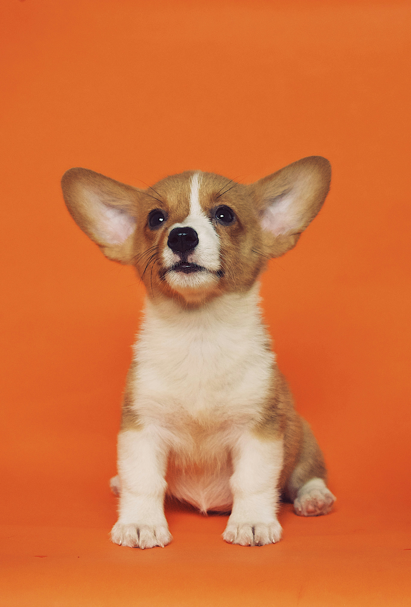  
</p>

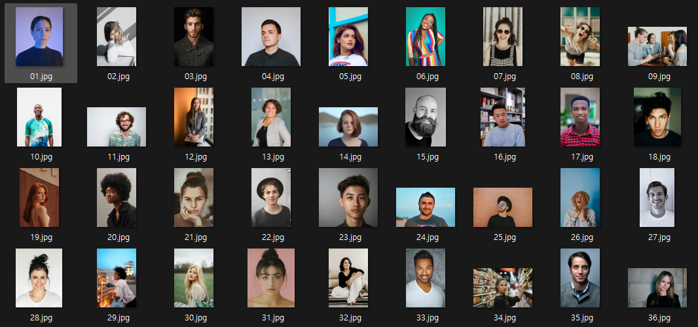

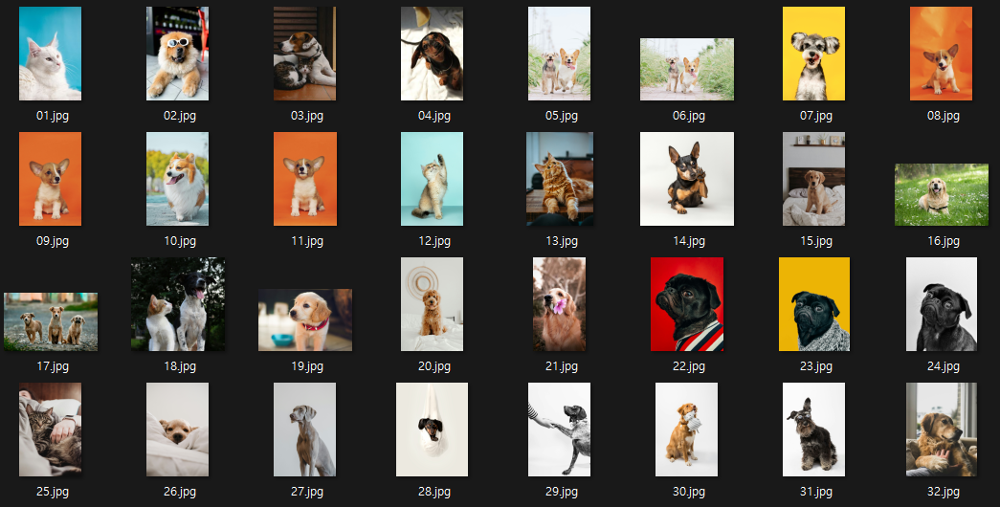


> 사진 촬영 시 주의 사항 <br> 사진을 다양한 거리에서 수집합낟. 거리를 일정하게 찍어나 흐린 사진 또는 초점이 맞지 않는 사진은 학습률이 떨어지므로 데이터 수집 시 주의한다. <br> 사진에서 객체의 위치는 정 중앙보다는 다양한 위치에 놓고 수집한다. <br>


* 객체 감지 학습을 위해 로컬디스크 ```(c:\)``` 에 "AI_Omniwheel" 퐅러를 생성한다.

* "AI_Omnisheel" 퐅더 안에 객체 감지 학습을 위해 'detect1_dataset' 폴더를 생성한다.

* 'detect_dataset' 폴터 안에 학습에 사용할 데이터 저장을 위한 'images' 폴터와 어노케이션 데이터 저장을 위한'annotation' 폴터를 생성한다.

* 'images' 폴더에 학습에 사용될 이미지 데이터를 저장한다. 폴더 명으로 구분할 필요 없이 통합하여 데이터를 추가하면 된다.

* 디렛토리 구조

```
C:\AI_OMNIWHEEL
\---detect1_dataset
    +---annotations
    \---images
            001.jpg
            002.jpg
            003.jpg
            004.jpg
            005.jpg
            ....

```

---

## 데이터 수집

* 소규모 데이터를 빠르고 효율적으로 수집하는 것이 목적이라면, 수만 장의 대용량 데이터를 통째로 다운로드받는 것보다
* 필요한 양만 골라서 다운로드할 수 있는 플랫폼이나 크롤링 도구를 활용하는 것이 훨씬 편리합니다.

1. Roboflow Universe (로보플로우 유니버스) – 가장 추천
   * 이미지뿐만 아니라 바운딩 박스(레이블)까지 포함된 데이터를 몇 십 장 단위로 골라 받기에 가장 좋은 플랫폼입니다.
   * 방법: Roboflow Universe 검색창에 Person and Dog 또는 Human and Cat 등을 검색합니다.
   * 특징: 전 세계 개발자들이 올린 수많은 소규모 프로젝트가 공개되어 있습니다. 그중 이미지 수가 100~200장 내외인 프로젝트를 선택해 'YOLO'나 원하는 포맷의 어노테이션 파일과 함께 통째로 다운로드받을 수 있습니다.
   * 60장 정도의 데이터라면 이미 완벽하게 라벨링된 소형 데이터셋을 찾는 것이 가장 빠릅니다.

2. 구글 크롬 확장 프로그램 (Fatkun / Image Downloader) – 직접 수집
   * 원하는 특정 구도나 명확한 종류의 사람/동물 이미지를 직접 눈으로 보고 고르고 싶을 때 유용합니다.
   * 방법: 구글 이미지나 핀터레스트(Pinterest)에서 '사람', '강아지'를 검색한 뒤, 크롬 확장 프로그램인 Fatkun Bulk Image Downloader나 Image Downloader를 사용해 한 페이지 내의 이미지를 한 번에 다운로드합니다.
   * 특징: 60장 정도는 1~2분 만에 수집할 수 있습니다. 단, 이 방법은 이미지 파일(JPG, PNG)만 다운로드되므로, 이후 앞서 언급한 로보플로우(Roboflow)나 CVAT 같은 툴에 직접 업로드하여 바운딩 박스를 그리는 데이터 어노테이션 작업을 직접 해주어야 합니다.

3. Open Images Dataset V7 (by Google) – 필터링 다운로드
   * 구글에서 제공하는 대규모 오픈셋이지만, 웹사이트 인터페이스가 잘 되어 있어 원하는 클래스만 선택해 소량 다운로드가 가능합니다.
   * 방법: Open Images Dataset 사이트의 'Explore' 메뉴로 이동합니다.
   * 특징: Person, Dog, Cat 등 원하는 클래스를 선택한 뒤 이미지들을 보면서 필요한 만큼만 골라 다운로드할 수 있습니다. 구글이 검증한 고품질 바운딩 박스 좌표가 함께 제공된다는 장점이 있습니다.

4. https://unsplash.com/ko

---


### (2) 데이터 어노테이션(Annotation)

(1) 'labelimg.exe' 파일을 실행한다.

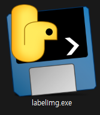

(2) 왼쪽 툴바의 'Change Save Dir' 버튼을 선택한다.

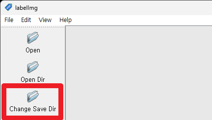

(3) 어노테이션 파일이 저장될 위치를 선택 후 '폴더 선택' 버튼을 클릭한다.

```
폴더 위치 : C:\AI_Omniwheel\detect1_dataset\annotations
```

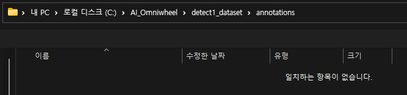

(4) 왼쪽 툴바 의 'Open Dir' 버튼을 선택한다.

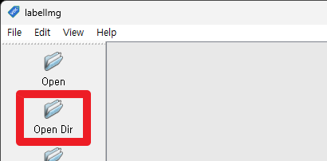

(5) 데이터가 저장된 위치를 선택 후 '폴더 선택' 버튼을 클릭한다.

```
폴더위치 : C:\AI_Omniwheel\detect1_dataset\images
```

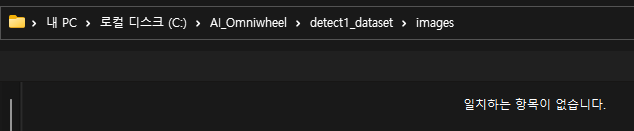

(6) 작업영역에 이미지가 표시된다.

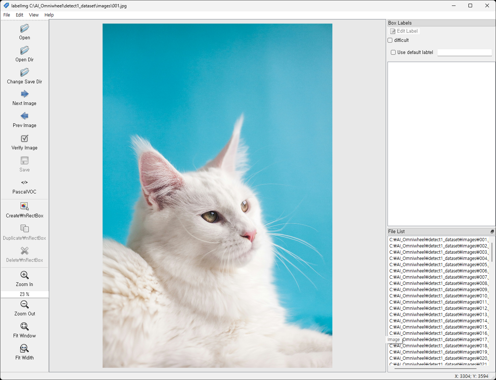

(7) 툴바의 'Create RectBox'를 선택한다. (단축키 W를 이용하면 빠르게 작업이 가능하다.)

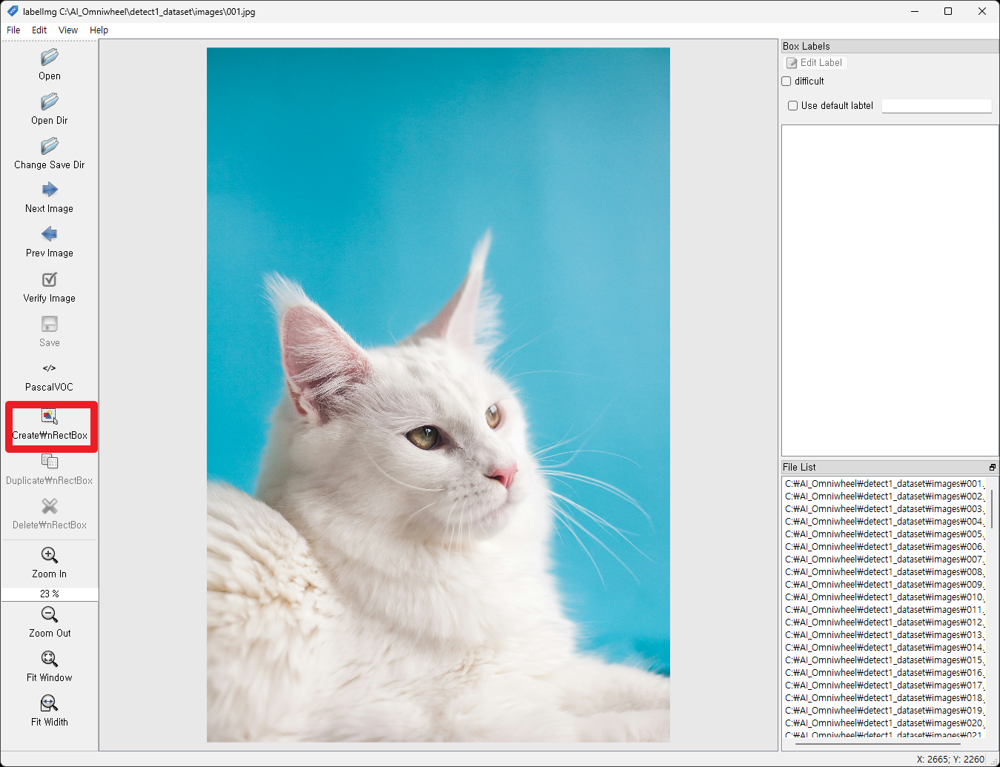

(8) 객체 감지 대상들의 위치를 지정한다.


(9) 해당 이미지의 레이블 값을 animal을 입력 후 "OK" 버튼을 선택한다.

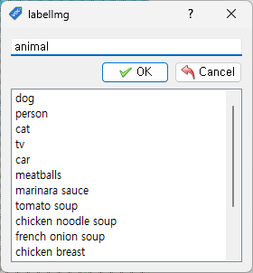

(10) 이미지에 바운딩 박스와 레이블 값이 입력되면 자동으로 색상이 입렬된다.

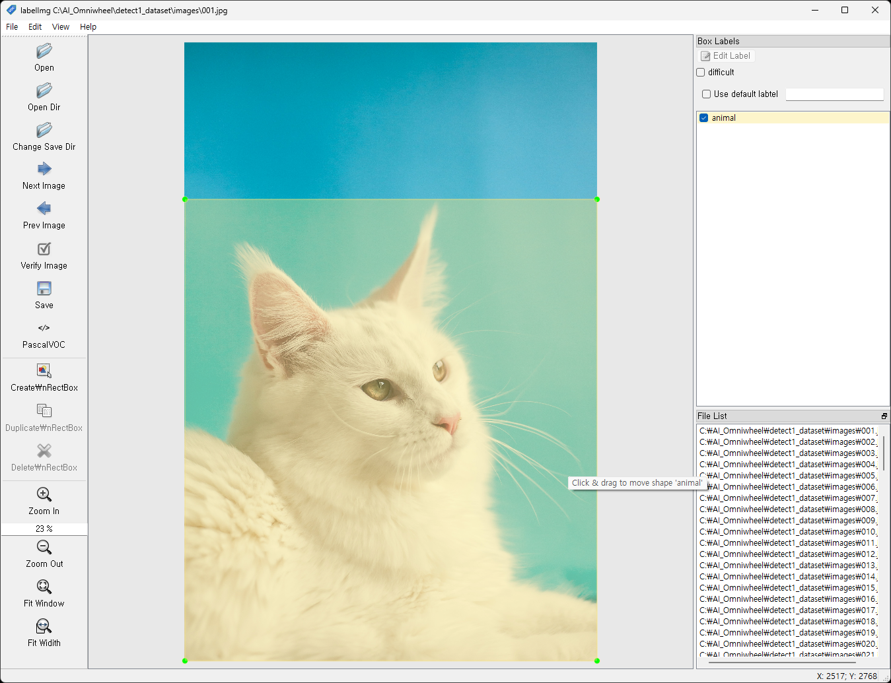

(11) 툴바의 'Next Image' 버튼을 선택하여 현재 내용을 저장 후 다음 이미지 작업을 진행한다.(단축키 D를 이용하면 빠르게 작업이 가능)

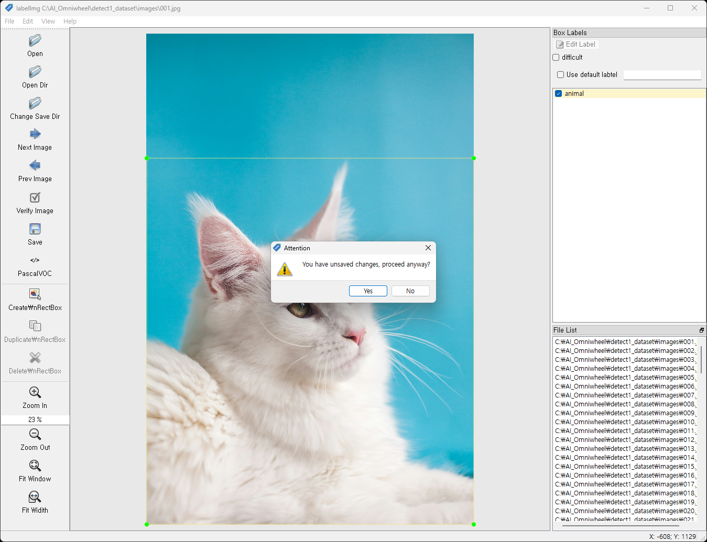

(12) 동물에 대하여 동일한 작업을 진행한다.

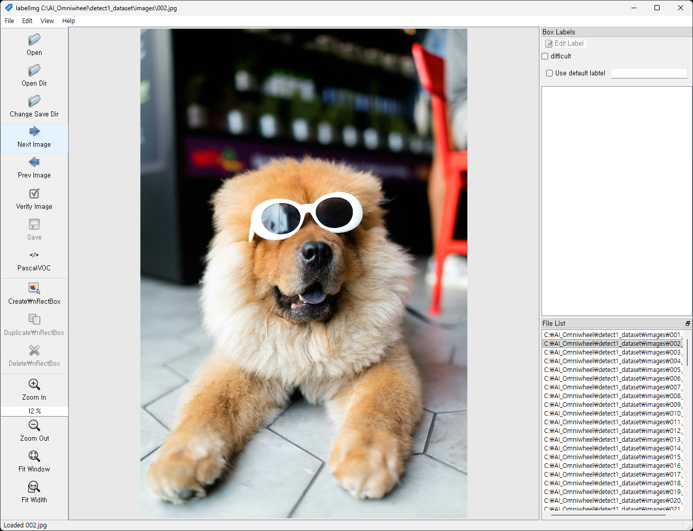

(13) 툴바의 'Create RectBx'를 선택한다. (단축키 W를 이용하면 빠르게 작업이 가능하다.)

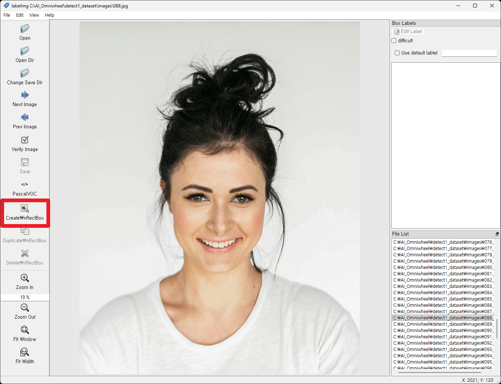

(14) 객체 감지 대상물의 위치를 지정한다.

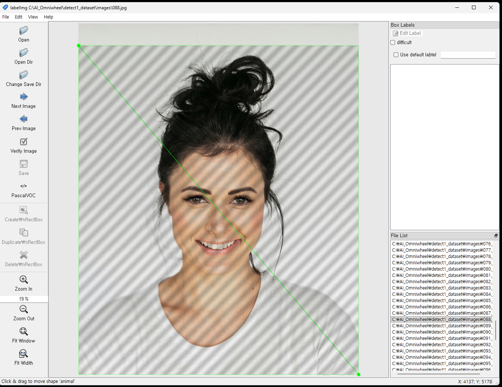

(15) 해당 이미지의 레이블 값으로 'persion'을 입력 후 'OK' 버튼을 선택한다.

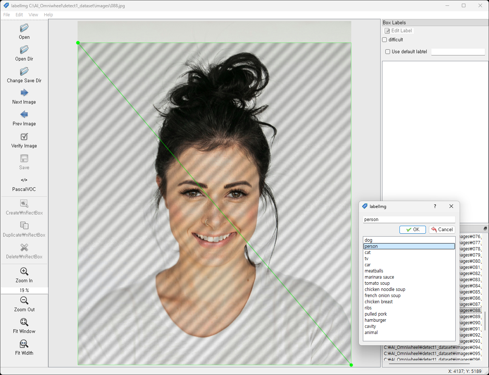

(16) 이미지에 바운딩 박스와 레이블 값이 입력되면 자동으로 색상이 입력된다.

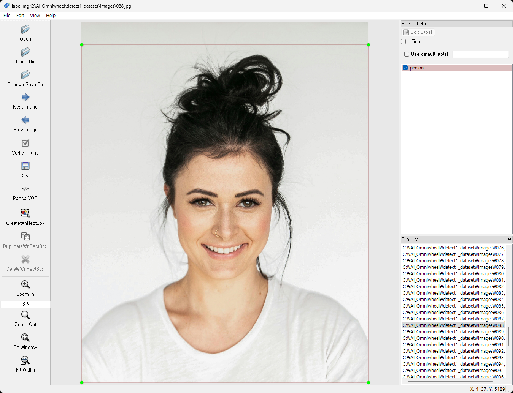

(17) 툴바의 'Next Image' 버튼을 선택하여 현재 내용을 저장 후 다음 이미지 작업을 진행한다. (단축키 D를 이용하면 빠르게 작업이 가능하다.)

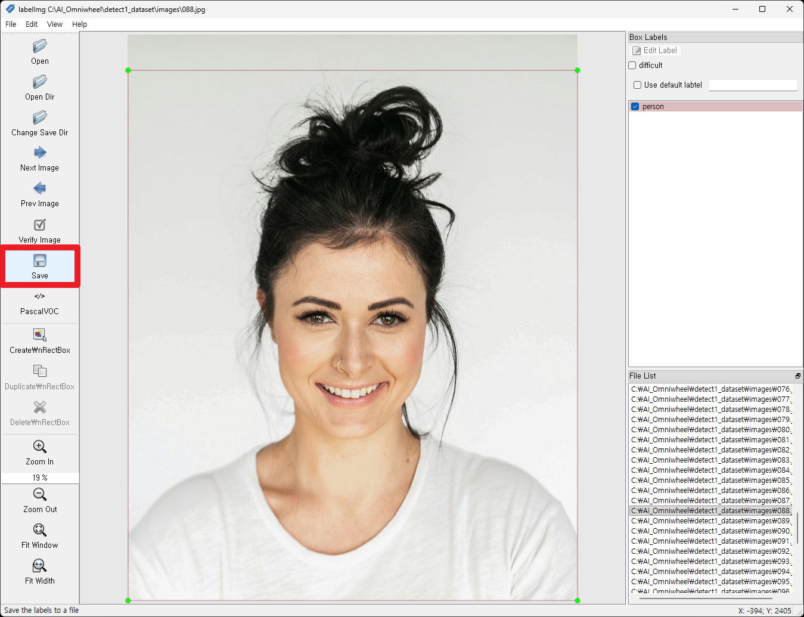

(18) 사람에 대하여 동일한 작업을 진행한다.

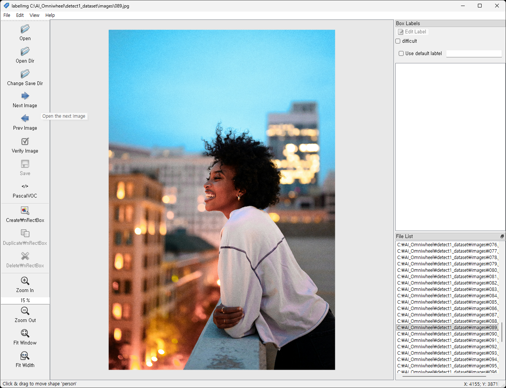

(19) 'annotation' 폴더에는 이미지 데이터 셋 제작 후 어노테이션 파일이 저장한다. 파일의 형태는 '.xml' 파일로 제작되어 있다.

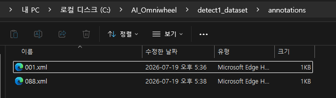

(20) 어노테이션 파일을 보면 다음과 같이 이미지에 대한 정보와 어노테이션 작업한 내용이 저장 되어 있다.


* 001.xml

```xml
<annotation>
	<folder>images</folder>
	<filename>001.jpg</filename>
	<path>C:\AI_Omniwheel\detect1_dataset\images\001.jpg</path>
	<source>
		<database>Unknown</database>
	</source>
	<size>
		<width>2717</width>
		<height>4076</height>
		<depth>3</depth>
	</size>
	<segmented>0</segmented>
	<object>
		<name>animal</name>
		<pose>Unspecified</pose>
		<truncated>1</truncated>
		<difficult>0</difficult>
		<bndbox>
			<xmin>4</xmin>
			<ymin>1034</ymin>
			<xmax>2717</xmax>
			<ymax>4074</ymax>
		</bndbox>
	</object>
</annotation>

```

* 088.xml

```xml
<annotation>
	<folder>images</folder>
	<filename>088.jpg</filename>
	<path>C:\AI_Omniwheel\detect1_dataset\images\088.jpg</path>
	<source>
		<database>Unknown</database>
	</source>
	<size>
		<width>3974</width>
		<height>5000</height>
		<depth>3</depth>
	</size>
	<segmented>0</segmented>
	<object>
		<name>person</name>
		<pose>Unspecified</pose>
		<truncated>1</truncated>
		<difficult>0</difficult>
		<bndbox>
			<xmin>5</xmin>
			<ymin>315</ymin>
			<xmax>3974</xmax>
			<ymax>4997</ymax>
		</bndbox>
	</object>
</annotation>

```

(21) 'detc_class.txt' 파일을 생성한다. 'detect_class.txt'  파일에는 데이터 어노테이션 과정에서 사용한 레이블을 목록으로 작성한다. 
* 어노테이션에서 사용한 레이블과 다르게 입력될 경우 다음('학습 데이터 제작하기')에서 에러가 발생한다.

* predefined_classes.txt (프로그램 설치 위치에 \windows_v1.8.1\data predefined_classes.txt 파일에 저장하면됨)

```
animal
person
```

---

## 아나콘다 설치

1. 아나콘다 다운로드 링크
   * 아래 공식 웹사이트에서 본인의 운영체제(Windows/Mac/Linux)에 맞는 최신 버전 인스톨러를 다운로드할 수 있습니다.
   * [아나콘다 공식 다운로드 페이지 (Anaconda Distribution)](https://www.anaconda.com/download)
   * Anaconda Distribution : https://repo.anaconda.com/archive/Anaconda3-2025.12-2-Windows-x86_64.exe

2. 아나콘다를 추천하는 이유
   * 원클릭 설치: 파이썬(Python)과 주피터 노트북뿐만 아니라, 향후 AI 학습이나 로봇 제어에 필요한 핵심 데이터 분석 라이브러리(NumPy, Pandas 등)가 한 번에 설치됩니다.
   * 환경 관리의 용이성: 프로젝트별로 독립된 가상환경을 쉽게 만들고 관리할 수 있어, 라이브러리 버전 충돌을 방지합니다.

3. 실행 방법
   1) 아나콘다를 설치합니다.
   2) PC에서 Anaconda Prompt 또는 터미널을 실행합니다.
   3) jupyter notebook 명령어를 입력하고 엔터를 누르면 웹 브라우저에서 주피터 노트북이 자동으로 열립니다.

---

## 1.2.2 학습용 데이터 제작하기

### 1) 프로그램 파일 생성

(1) PC에 설치된 'Jupyter Notebook'을 실행한다.
   * C 드라이브로 이동 후에 'jupyter notebook' 를 입력하여 실행
```
c:\>cd \  

cd AI_Omniwheel

cd AI_Omniwheel>jupyter notebook

```

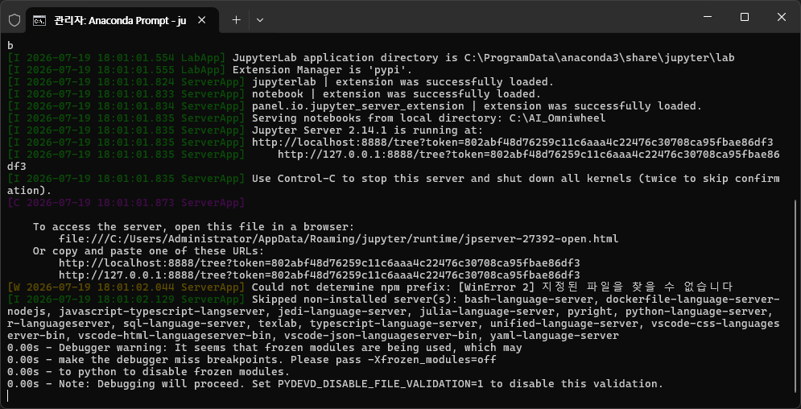

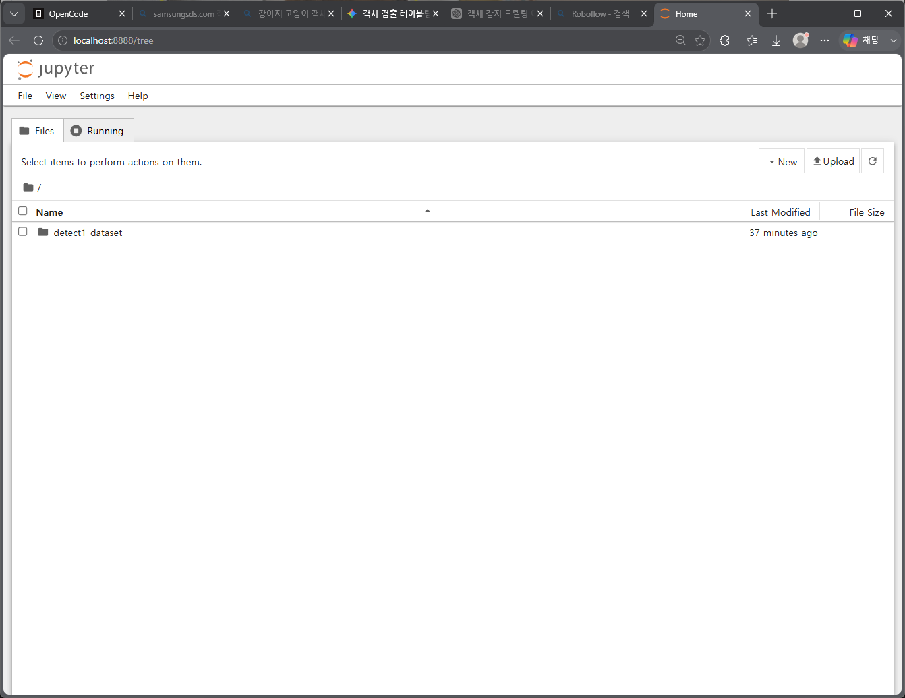


(2) 실습용 포터를 생성 후 이동한다.

(3) 우측의 'New' 버튼을 눌러 'Python 3'를 선택한다.

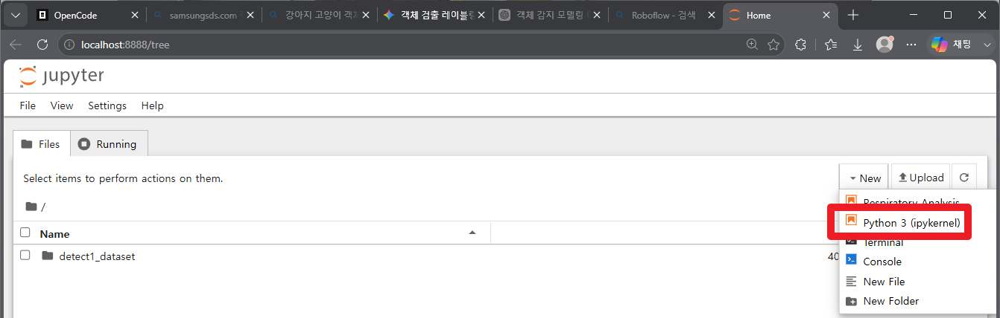

(4) 상단 'Untitled'를 선택하여 실습 제목을 번경한다.

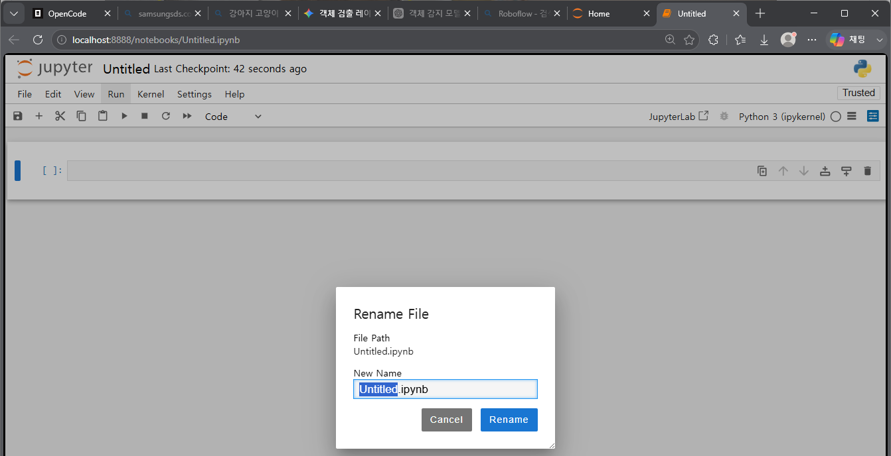

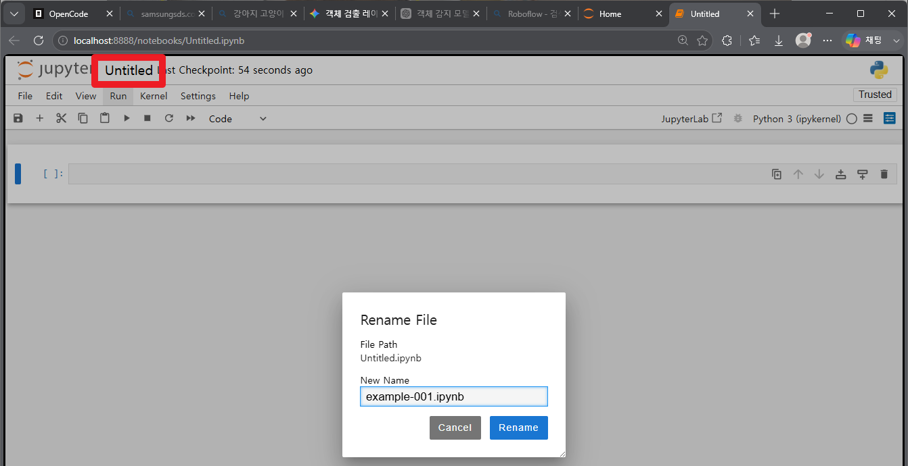

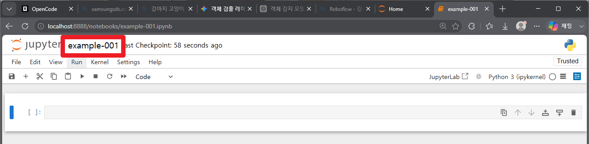

### 2) 프로그램 작성

* 시스템 운영을 위해 'os' 모듈을 추가한다.
* 인공지능 학습에 필요한 파이썬 모듈이 설치된 'bready' 모듈 중 객체감지에 필요한 'objectDetector' 모듈을 추가한다.

```
import os
from bready.object_detection_tools import ObjectDetector
```


* 객체감지 학습을 위해 객체를 'detection_trainer'로 생성한다.

```
detection_trainer = ObjectDetector.Trainer()
```

* 'setImageDirectory()' 함수로 학습에 사용할 이미지 데이터 경로를 설정한다.
* 이때, 경로는 앞에서 생성한 'images' 폴더가 있는 경로이어야 하며, 경로에서 ```"\"```는 ```"/"```로 변경하여야 한다.

```
detection_trainer.setImageDirectory("C:/AI_Omniwheel/detect1_dataset/images")
detection_trainer.setAnnotationDirectory("C:/AI_Omniwheel/detect1_dataset/annotations")
detection_trainer.setClassDirectory("C:/AI_Omniwheel/detect1_dataset/detect_class.txt")
```

* 'setDataDirectory' 함수로 학습 데이터를 저장할 경로를 설정한다. 폴터 내 'training_data' 폴더가 없는 경우 자동으로 생성된다.

```
detection_trainer.setDataDirectory("training_data")
```

* 'generateTFRecoeds()' 함수로 학습 데이터를 제작한다.

```
detection_trainer.generateTFRecoeds()
```


### 3) 실행과 결과

(1) 동작을 실행하기 위해 상단의 'Restart' 버튼을 선택한다.

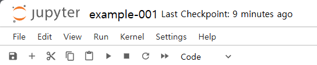

(2) 학습 데이터 제작이 완료되면 실행 결과가 나타난다.

(3) 'training_data' 이름의 학습 데이터가 저장된 폴더가 생성된다.

(4) 'training_data' 폴더에는 4개의 학습 데이터 파일이 생성되어 있다.

   * detection_classes.txt : 객체 감지에 필요한 목록
   ```
	preson
    animal
   ```

   * train.csv : 어노테이션 파일이 통합된 자료이다.

   * train.record : 'train.csv' 데이터를 Tensorflow에서 사용하는 학습용 데이터 형식으로 변환된 파일이다(TFRecord 파일)

   * train.label.pbtxt : Tensorflow 에서 읽어오는 객체 정보에 대한 label 파일이다.


## 1.2.3 객체 감지 학습하기

### 1) 프로그램 파일 생성

(1) 우측의 'New' 버튼을 눌러 'Python 3'를 생성한다.

(2) 상단 'Untitled'를 선택하여 실습 제목을 번경한다. (이름 : example-002)

### 2) 프로그램 작성

* 시스템 운영을 위해 'os' 모듈을 추가한다.
* 인공지능 학습에 필요한 파이썬 모듈이 설치된 'bready' 모듈 중 객체감지에 필요한 'objectDetector' 모듈을 추가한다.

```
import os
from bready.object_detection_tools import ObjectDetector
```


* 객체감지 학습을 위해 객체를 'detection_trainer'로 생성한다.

```
detection_trainer = ObjectDetector.Trainer()
```

* 'setDataDirectory()' 함수로 학습 데이터를 저장할 경로를 설정한다. 폴터 내 'training_data' 폴더가 없는 경우 자동으로 생성된다.

```
detection_trainer.setDataDirectory("training_data")
```

* 'setSaveModelDirectory()' 함수로 학습 데이터를 저장할 경로를 설정한다. 폴터 내 'training_data' 폴더가 없는 경우 자동으로 생성된다.

```
detection_trainer.setDataDirectory("models")
```

* 'setMaxStep()' 함수로 학습할 횟수를 입력한다.
* 'setBathSize()' 함수로 학습에 사용할 이미지의 수량을 설정한다.

```
detection_trainer.setMaxStep(200)
detection_trainer.setBathSize(24)
```

* 'setModelType()' 함수로 학습에 사용할 알고르짐(신경망)을 설정한다. 여기서는 'SSD MobileNet V1'을 사용한다.
* 이는 객체감지를 위한 알고리즘 중 하나이다.

```
detection_trainer.setModelType(ObjectDetector.ModelType.SSD_MOBILENET_V1)
```

* 'setAugmentation_Option()' 함수를 사용하여 전처리 옵션을 설정한다.
* 전처리 옵셥은 학습 이미지에 인위적으로 변화를 주어 학습에 사용한다.
* 옵션을 사용하지 않을 때에는 "True"를 "Fail"로 변경할 수 있다.
   * SSD_RANDOM_CROP : 인위적으로 자르기
   * HORIZONTAL_FLIP : 좌우 반전
   * VERTICAL_FLIP : 상하 반전
   * RANDOM_BRIGHTNESS : 인위적으로 밝기 조절

```
detection_train.setAugementation_Option(ObjectDetector.Image_Augmentation.SSD_RANDOM_CROP, True)
detection_train.setAugementation_Option(ObjectDetector.Image_Augmentation.SSD_HORIZONTAL_FLIP, True)
```

* 'setPretrainedModel()' 함수로 사전 학습된 'coco' 모델을 사요하여 학습시 지능을 더 높여준다.

```
detection_train.setPretrainedModel('coco')
```

* 'train()' 함수로 학습을 시작한다. 'continue_training'을 'False'로 하여 이어서 학습하지 않도록 설정하고,
* 'overwrite'를 'True'로 하여 이미 'models' 폴더가 있는 경우 내용을 삭제 후 학습을 진행한다.

```
detection_train.train(continue_training=False, overwrite=True)
```

* 'dispose()' 함수로 세션을 초기화 시킨다.

```
detection_train.dispose()
```
  


### 3) 실행과 결과

(1) 동작을 실행하기 위해 상단의 'Restart' 버튼을 선택한다.


(2) 학습이 진행되면 과정이 표시된다.

* 학습이 시작된다.

* 학습이 완료되었다.

(3) 'models' 이름의 학습 모델이 저장된 폴더가 생성된다.

(4) 'models' 폴더에는 여러 개의 파일이 생성되어 있다.

   * checkpoint : 학습 모델의 체크포인트 번호의 기록이 저장된 파일이다.
   * model.skpt* : 모델에 대한 정보를 담고 있기 때문에 재학습이 가능하다. 모델 실행기 필요 없는 정보까지 가지고 있어서 무섭다.


## 1.2.4 객체 감지 추론 그래프 제작하기

### 1) 프로그램 파일 생성

(1) 우측의 'New' 버튼을 눌러 'Python 3'를 생성한다.

(2) 상단 'Untitled'를 선택하여 실습 제목을 번경한다. (이름 : example-002)


### 2) 프로그램 작성

* 시스템 운영을 위해 'os' 모듈을 추가한다.
* 인공지능 학습에 필요한 파이썬 모듈이 설치된 'bready' 모듈 중 객체감지에 필요한 'objectDetector' 모듈을 추가한다.

```
import os
from bready.object_detection_tools import ObjectDetector
```


* 객체감지 학습을 위해 객체를 'detection_trainer'로 생성한다.

```
detection_trainer = ObjectDetector.Trainer()
```

* 'setSaveModelDirectory()' 함수로 학습 데이터를 저장할 경로를 설정한다. 폴터 내 'training_data' 폴더가 없는 경우 자동으로 생성된다.

```
detection_trainer.setDataDirectory("models")
```

* 'freeze_graph()' 함수로 학습 모델을 내보낸다. 'checkpoint'는 앞에서 학습 모델의 체크포인트 번호를 입력하고, 'output_directory'에는 내보낸 학습 모델을 저장할 경로를 설정한다.
* 폴더 내 'recofnition' 폴더가 없는 경우 자동으로 생성된다. 또한 'overwrite'를 'True'로 하여 이미 'recognition' 폴터가 있는 경우 내용을 삭제 후 학습을 진행한다.

```
detection_trainer.freeze_graph(checkpoint=200, output_directory='recognition',overwrite=True)
```


### 3) 실행과 결과

(1) 동작을 실행하기 위해 상단의 'Restart' 버튼을 선택한다.


(2) 추론 그래프 생성이 완료되면 실행 결과가 나타난다.

(3) 'recognition'이름이 추론 그래프가 저장된 폴더가 생성된다.

(4) 'recognition' 폴더에는 다음과 같은 폴더들이 생성되어 있다.

   *  frozen_interence_graph.pb : 추론 그래프, 학습이 완료된 그래프에 대한 내용을 export 해놓은 파일러서 이 파일을 다시 로딩하여 예측(prediction)을 수행한다.
   *  model.ckpt*** : 학습모델에 대한 정보가 담긴 파일이다.


## 1.2.5 객체 감지 추론하기

### 1) 프로그램 파일 생성

(1) 우측의 'New' 버튼을 눌러 'Python 3'를 생성한다.

(2) 상단 'Untitled'를 선택하여 실습 제목을 번경한다. (이름 : example-002)

### 2) 프로그램 작성

* 시스템 운영을 위해 'os' 모듈을 추가한다.
* 영상처리를 위해 'cv2' 모듈을 추가 한다.
* 시간 지연을 위해 'time' 모듈을 추가한다.

```
import os
import cv2
import time
```

* 카메라 영상을 사용하기 위해 'PyCamera' 모듈을 추가한다.
* 인공지능 학습에 필요한 파이썬 코듈이 설치된 'bready' 모듈 중 객체감지에 필요한 'objectDetector' 모듈을 추가한다.

```
import bready.camera_utils.PyCamera as PyCamera
from bready.object_detection_tools import ObjectDetector
```

* 화면에 위셋을 사용하기 위해 'widgets' 모듈을 추가한다.
* 현재 화면에 표시하기 위해 'IPython.display' 모듈을 추가한다.

```
import ipywidgets.widgets as widgets
import IPython.display
```

* 'USBCamera()' 함수로 PC와 연결된 카메라 영상의 이미지 데이터를 받아'camera' 객체로 선언한다.

```
camera = PyCamera.USBCamera(0)
```

* 'ObjectDetector.Tester()' 함수로 객체감지의 최종 모델과 클래스 파일의 경로를 설정하여 'obj_model' 객체로 저장한다.

```
obj_model =

```


* 임베디드 시스템에서 이밎 처리과정과 Jupyter 커널을 맞춰주기 위한 'widget' 모듈을 사요하여 'image_widget' 객체에 'jpeg' 포멧의 이미지를 저장한다.
* 카메라로 읽은 이미지 데이터를 출력한다.

```
image_widget = widget.Image("format='jpeg')
IPython.display.display(image_widget)
```

* while() 문으로 반복하여 동작되도록 한다.
	*  프로그램이 시작되면 실행된다.

```
while(True) :
	try :
		image = camera.get_frame()
```

* 이미지가 없는 경우 프로그램을 종료한다.

```
if(image is None)
	break
```

* 'execute()'함수로 'image'에 대한 객체감지 추론을 실행한다.

```
obj_model.execute(image)
```

* 'getResultImage()' 함수를 사용하여 추론 결과를 'result_image' 변수에 저장한다.

```
result_image = obj_model.getResultImage()
```


* 'cv2_imencode()' 함수를 호출하여 'display' 출력 변수에 대이터를 저장한다.
* 데이터 저장형식은 'jpeg'와 객체감지 추론결과인 'result_image'를 넘겨준다.
* 단 'result_image'는 배열의 데이터를 가지고 있으므로 문자열의 형식은
* 'tostring()'함수를 이용해 문자열로 변환하여 배열의 '[1]' 데이터부터 넘겨준다.
* ('result_image'의 첫 번째 데이터 '[0]'은 객체감지 추론성공 여부 '[True]'를 가지고 있으므로 넘겨 주지 않는다.)

```
image_widget.value = cv2.imencode("jpeg", redule_image)[1].tostring()
```


* jetson 보드에 시스템 과부하를 막기 위해 0.01초의 시간을 지연시킨다.

```
	time.sleep(0.01)
```

* 키보드 인터럽트(Ctrl+C)가 발생하면 실행된다.
* print() 함수를 이용해 종료를 출력한 뒤 프로그램을 종료한다.

```
except KeyboardInterrupt:
	print("종료")
	break
```


### 3) 실행과 결과

(1) 동작을 실행하기 위해 상단의 'Restart' 버튼을 선택한다.


(2) 프로젝트가 실행되면 설정한 카메라의 정보가 표시된다.

(3) 학습 데이터로 사용한 동물과 사람을 각각 카메라에 인식시켜 본다. 각 대상이 감지되고 인식률도 표시된다.

(4) 카메라 동작을 멈추기 위해 'Stop' 버튼을 선택한다.


