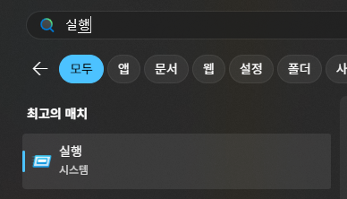
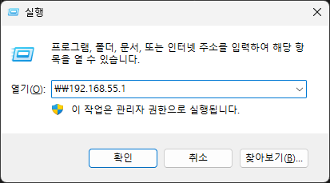

# 사람과 동물을 인식하는 로봇 구현

## 1.3.1 학습모델 준비하기

(1) PC와 로봇을 Micro 5pin 케이블로 연결한다.


(2) 로봇의 전원 스위치를 ON 시킨다.


(3) PC의 "실행" 앱에서 아래와 같이 입력 하여 로봇에 접속한다.

```
\\192.168.55.1
```





(4) 로봇과 접속이 완료되면 아래와 같이 풀더가 표시된다.

## 1.3.2 모델 최적화하기


## 1.3.3 로봇에서 사람과 동물 감지


