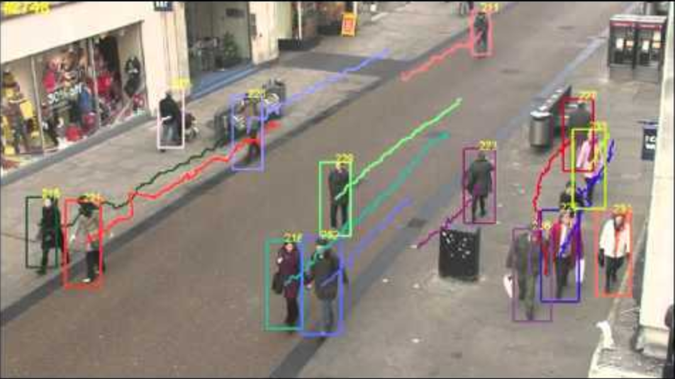
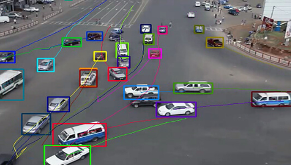
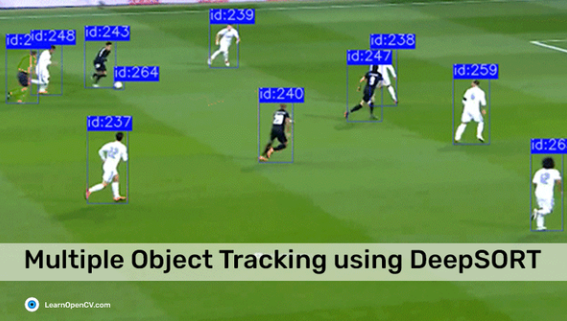
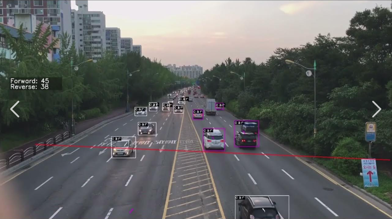

# Cahpter 2. 객체 추적 AI

> 학습 목표   객체 추적의 원리를 이해한다.   인공지능 모델을 불러와 객체 추적을 확인할 수 있다.   로봇이 객체를 추적하는 동작을 수행할 수 있다.

## 2.1 준비하기

| 영상 분석(CCTV)  |  자율 주행 | 스포츠 & 게임 |
|:-------:|:-------:|:-------:|
|  |   |  | 

https://blog-ko.superb-ai.com/object-tracking-technology-for-video-analysis/

* 객체 추적 기술은 카메라로 촬영되는 영상에서 사람이나 동물, 차량 등의 특정한 객체의 위치 변화를 찾는 컴퓨터 비전 기술이다. 일련의 영상 프로엠 내 객체의 이동위치, 측정 또는 감지되고 있는 객체의 정보를 활용하여 객체의 위치변화를 추적한다. 이러한 기술은 실시간 영상 보안, 영상 통화, 교통통제, 증강 현실 등의 여러 분야에서 사용되고 있는 기술이다.
* 대표적으로 사용되는 방향은 치안을 대비한 지능형 영상 감시 스세템에 주로 사용된다. 사람 및 차량의 이동경로 예측을 진행하여 범죄 예방 또는 대상의 위치추적을 사용하기에 많이 사용되는 기술 중 하나이다. Object Tracking 기술은 감지된 객체감지 하여 감지된 객체의 이동방향을 계산한 뒤 예측을 하는 기술이다. Object Detecting인공지능의 객체감지 데이터를 활용하여 프레임 별 객체의 전, 후 사진을 비교하여 감지된 대상의 위치를 추적한다.

* 객체 추적 기술은 다양한 방법(알고리즘)으로 사용되고 있다. [그림1]과 같이 객체 추적 기술을 이용해 감지된 객체의 위치 변화를 계산단 다음 객체의 행동 패턴을 분석하여 객체가 다음 행동할 '예측' 알고리즘으로 사용한다.

[그림2] 자동차 객체 추적

* 다른 방법으로 사용 예는 Object Tracking Line Counting 기술이다. [그림 3]과 같이 감지된 객체를 추적하여 입력된 기준선에 적용하여 감지된 객체(차량)이 기준선에 근접하거나 기준선을 지나칠 경우를 영상의 각 프레임별 데이터를 입력 받아 비교하여 숫자를 증가, 감소시키는 방법으로 사용이 가능하다.

[그림 3] 객체 기준선 감지 카운팅
* https://www.youtube.com/watch?v=f6Ad2FMyYcM

